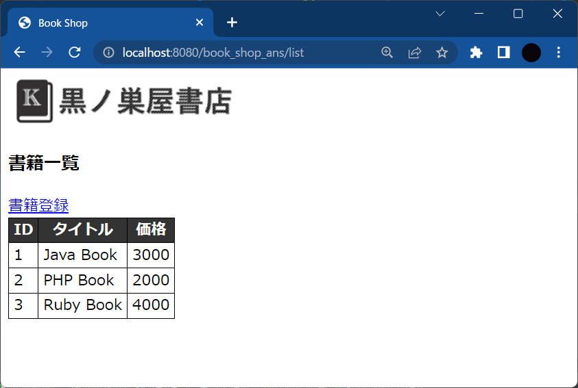

# Servlet/JSP MVC演習

## 準備

書籍情報を表示したり、編集したりするWebアプリケーションをMVCパターンに従って作成します。次のプロジェクト（Zipファイル）をインポートして開発を進めてください。

[演習用プロジェクト](./src/book_shop.zip)

> Eclipseでのインポート手順<br>①インポート -> フォルダまたはアーカイブからプロジェクト -> [アーカイブ]ボタン -> Zipファイルを選択<br>②フォルダーのリスト内の一番上にある「book_shop.zip_expanded」のチェックを外して[完了]ボタンをクリック

<br>
<br>


<br>

## テーブル定義

**BOOKテーブル**

| # | 列名<br>（物理） | 列名<br>（論理） | データ型 | PK | UK | NN | FK | デフォルト | 備考 |
|:-:|:--|:--|:--|:-:|:-:|:-:|:--|:--|:--|
| 1 | ID | 本ID | INTEGER | ● |  |  |  |  | 自動採番 |
| 2 | TITLE | タイトル | VARCHAR(100) |  |  | ● |  |  |  |
| 3 | PRICE | 価格 | INTEGER |  |  | ● |  |  |  |
| 4 | CAT_ID | カテゴリID | INTEGER |  |  |  | CATEGORY(ID) |  |  |

> PK: Primary Key（主キー）、UK: Unique Key（一意）、NN: Not Null、FK: Foreign Key（外部キー）

<br>

**CATEGORYテーブル**

| # | 列名<br>（物理） | 列名<br>（論理） | データ型 | PK | UK | NN | FK | デフォルト | 備考 |
|:-:|:--|:--|:--|:-:|:-:|:-:|:--|:--|:--|
| 1 | ID | カテゴリID | INTEGER | ● |  |  |  |  | 自動採番 |
| 2 | CAT_NAME | カテゴリ名 | VARCHAR(50) |  | ● | ● |  |  |  |

<br>

**DDL + 初期データ**

```sql
CREATE TABLE CATEGORY (
    ID INTEGER PRIMARY KEY AUTO_INCREMENT,
    CAT_NAME VARCHAR(50) UNIQUE NOT NULL
);

CREATE TABLE BOOK (
    ID INTEGER PRIMARY KEY AUTO_INCREMENT,
    TITLE VARCHAR(100) NOT NULL,
    PRICE INTEGER NOT NULL,
    CAT_ID INTEGER,
    FOREIGN KEY (CAT_ID) REFERENCES CATEGORY(ID)
);

INSERT INTO CATEGORY VALUES (1, 'IT/コンピュータ');
INSERT INTO CATEGORY VALUES (2, '経済・経営');
INSERT INTO CATEGORY VALUES (3, '小説');
INSERT INTO CATEGORY VALUES (4, 'マンガ');

INSERT INTO BOOK VALUES (1, 'Java Book', 3000, 1);
INSERT INTO BOOK VALUES (2, 'PHP Book', 2000, 1);
INSERT INTO BOOK VALUES (3, 'Ruby Book', 4000, 1);
```

<br>

## エクササイズ

### 課題0（書籍一覧）

- context.xml　**※作成済み**
	- データベース接続の情報を定義する
- DataSourceManager.java　**※作成済み**
	- DataSourceを⽤いたコネクションを取得するクラス
- BookDto.java　**※作成済み**
	- 書籍を表現するクラス
- BookDao.java　**※作成済み**
	- 書籍データを管理するクラス
- BookListServlet.java　**※要修正**
	- 書籍の⼀覧表⽰を管理するサーブレット
    - コメントの**TODO**の部分を実装する
- list.jsp　**※要修正**
	- 書籍の⼀覧表⽰を管理するJSP
    - コメントの**TODO**の部分を実装する
    - WEB-INFフォルダ配下に作成する
    > WEB-INFフォルダに配置することでクライ
アントからJSPファイルへの直接的なアクセスを禁⽌することができます。

<br>

**＜期待結果＞**

Tomcatを起動している状態で、ブラウザから以下のURLにアクセスします。<br>http://localhost:8080/book_shop/list


<br><br>

### 課題1（書籍登録）

書籍登録画面から書籍を新規登録するプログラムを作成します。

- list.jsp　**※要修正**
	- 書籍登録リンクを追加する
- add.jsp　**※作成済み**
- BookAddServlet.java　**要新規作成**
- BookListServlet.java　**※要新規修正**
	- doGet
    	- 登録画面（add.jsp）にフォワードする
    - doPost
    	- 入力データ（リクエストパラメータ）を取得する
        - Bookテーブルにデータを登録する
        - BookListServletにリダイレクトする

<br>

**＜期待結果＞**

Tomcatを起動している状態で、ブラウザを開いて以下のURLにアクセスします。<br>http://localhost:8080/book_shop/list



書籍登録リンクをクリックすると次の画⾯が表⽰されます。


登録画⾯で下記の情報を⼊⼒して登録ボタンをクリックします。
- タイトル ︓ Python Book
- 価格 ︓ 5000


<br><br>

### 課題2（書籍削除）

書籍一覧画面から書籍を削除するプログラムを作成します。

- list.jsp　**※要修正**
	- 削除ボタンを追加する
- BookDeleteServlet.java　**要新規作成**
	- doPost
    	- リクエストパラメータ（ID）を取得する
        - IDをもとにBookテーブルの対象データを削除する
        - BookListServletにリダイレクトする

<br>

**＜期待結果＞**

Tomcatを起動している状態で、ブラウザを開いて以下のURLにアクセスします。<br>http://localhost:8080/book_shop/list


Python Bookの削除ボタンをクリックするとPython Bookのデータが削除されて⼀覧画⾯に遷移します。


<br><br>

### 課題3（書籍更新）

書籍編集画面から書籍を更新するプログラムを作成します。

- list.jsp　**※要修正**
	- 編集ボタンを追加する
- edit.jsp　**※要修正**
	- コメントの**TODO**の部分を実装する
- BookEditServlet.java　**※要新規作成**
	- doGet
    	- リクエストパラメータ（ID）を取得する
        - IDをもとにBookデータを取得する
        - Bookデータをリクエストに格納する
    	- 編集画面（edit.jsp）にフォワードする
    - doPost
    	- 入力データ（リクエストパラメータ）を取得する
        - Bookテーブルの対象データを更新する
        - BookListServletにリダイレクトする

<br>

**＜期待結果＞**

ブラウザを開いて以下のURLにアクセスします。<br>http://localhost:8080/book_shop/list


Ruby Bookの編集ボタンをクリックすると次の画⾯が表⽰されます。


編集画⾯でタイトルと価格を変更して編集ボタンをクリックするとRuby Bookのタイトルと価格が更新されて⼀覧画⾯に遷移します。


<br><br>